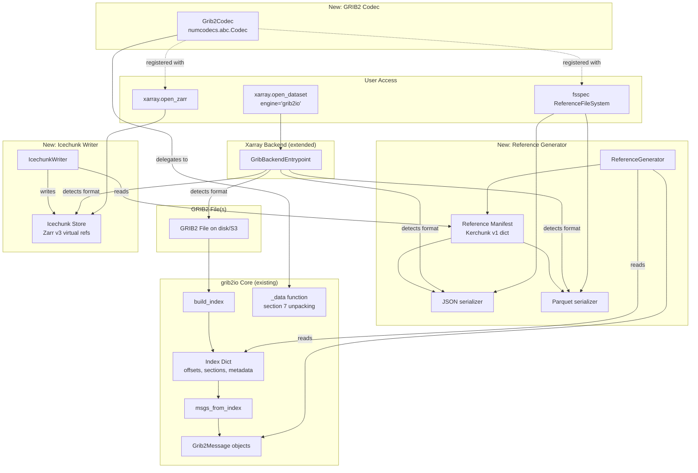

# Design Document: Kerchunk & Icechunk Support for grib2io

## Overview

This feature adds the ability for grib2io to produce [Kerchunk](https://fsspec.github.io/kerchunk/)-compatible reference manifests and write virtual chunk references into [Icechunk](https://icechunk.io/) stores from GRIB2 files. The core idea is to reuse grib2io's existing `build_index()` infrastructure — which already knows every message's byte offset, section sizes, and metadata — to emit lightweight Zarr-compatible references instead of copying data.

The implementation introduces three main components:

1. **Reference Generator** (`grib2io.kerchunk`) — Scans a GRIB2 file's index and produces a Kerchunk v1 reference manifest mapping Zarr chunk keys to `[url, offset, length]` tuples within the original file.
2. **GRIB2 Codec** (`grib2io.codecs.Grib2Codec`) — A `numcodecs.abc.Codec` implementation that decodes raw GRIB2 section 7 bytes into NumPy arrays, enabling Zarr reads through the reference filesystem.
3. **Icechunk Writer** (`grib2io.icechunk`) — Writes reference manifests into an Icechunk virtual store, creating versioned Zarr v3 datasets backed by original GRIB2 file bytes.

These components integrate with the existing xarray backend (`GribBackendEntrypoint`) so users can open reference files or Icechunk stores with `engine="grib2io"` and get the same coordinate/dimension conventions as direct GRIB2 reads.

### Key Design Decisions

- **Reuse `build_index()`**: The existing index already captures all byte offsets, section metadata, and message structure needed for reference generation. No new file scanning logic is required.
- **Codec-based decoding**: Rather than pre-decoding data, references point to raw GRIB2 section bytes. A registered numcodecs codec handles decoding on read, keeping the reference files small and the data access lazy.
- **Section 5 metadata in codec config**: The codec needs Data Representation Template (DRT) parameters, grid definition, and bitmap info to decode. These are stored as JSON-serializable codec configuration alongside each `.zarray` entry.
- **Optional dependencies**: `kerchunk`, `numcodecs`, and `icechunk` are optional extras. Core grib2io functionality is unaffected when they are not installed.

## Architecture



### Data Flow

1. **Reference Generation**: `build_index()` scans the GRIB2 file → index dict → `ReferenceGenerator` maps each message to Zarr chunk keys with `[file_url, section7_offset, section7_length]` tuples → populates `.zarray`, `.zattrs`, `.zgroup` metadata → outputs Kerchunk v1 manifest dict.

2. **Serialization**: The manifest dict is written to JSON (via `json.dumps`) or Parquet (via `kerchunk.df.refs_to_dataframe`).

3. **Reading via Kerchunk**: `fsspec.filesystem("reference", fo=manifest)` creates a virtual Zarr store → Zarr reads chunk keys → fsspec fetches raw bytes from GRIB2 file at specified offset/length → `Grib2Codec.decode()` unpacks the bytes into a NumPy array.

4. **Icechunk Writing**: `IcechunkWriter` iterates the manifest → calls `store.set_virtual_ref(chunk_key, url, offset, length)` for each data chunk → writes Zarr metadata as native Icechunk metadata → commits the transaction.

5. **Xarray Integration**: `GribBackendEntrypoint.open_dataset()` detects whether the input is a GRIB2 file, a JSON/Parquet reference, or an Icechunk URI, and dispatches accordingly.

## Components and Interfaces

### 1. ReferenceGenerator (`grib2io/kerchunk.py`)

```python
class ReferenceGenerator:
    """Generate Kerchunk v1 reference manifests from GRIB2 files."""

    def __init__(
        self,
        file_paths: Union[str, List[str]],
        filters: Optional[Dict[str, Any]] = None,
    ):
        """
        Parameters
        ----------
        file_paths : str or list of str
            One or more GRIB2 file paths (local or remote URI).
        filters : dict, optional
            Filter GRIB2 messages by metadata attributes (same keys as
            xarray backend filters).
        """

    def generate(self) -> dict:
        """
        Scan files and produce a Kerchunk v1 reference manifest.

        Returns
        -------
        dict
            Kerchunk reference spec v1 dict with keys:
            - "version": 1
            - "refs": {chunk_key: [url, offset, length] | json_str, ...}
        """

    def to_json(self, output_path: str) -> None:
        """Serialize the manifest to a JSON file."""

    def to_parquet(self, output_path: str) -> None:
        """Serialize the manifest to a Parquet reference store."""
```

**Internal helpers** (module-level functions):

- `_build_chunk_key(var_name, dim_indices) -> str` — Constructs Zarr chunk key like `"TMP/0.0.0"`.
- `_build_zarray_metadata(msg, shape, chunks, codec_config) -> dict` — Builds `.zarray` JSON for a variable.
- `_build_zattrs(msg) -> dict` — Extracts GRIB2 section metadata as Zarr attributes.
- `_map_messages_to_dimensions(msgs, index) -> dict` — Groups messages by variable and maps to dimension indices (level, leadTime, refDate, etc.) using the same logic as `parse_grib_index()`.

### 2. Grib2Codec (`grib2io/codecs.py`)

```python
from numcodecs.abc import Codec
from numcodecs.registry import register_codec

class Grib2Codec(Codec):
    """Zarr codec for decoding raw GRIB2 section 7 bytes."""

    codec_id = "grib2io"

    def __init__(
        self,
        drtn: int,
        drt: List[int],
        gdtn: int,
        gdt: List[int],
        gds: List[int],
        nx: int,
        ny: int,
        bitmap_flag: int,
        bitmap_offset: Optional[int] = None,
        bitmap_length: Optional[int] = None,
        scan_mode_flags: Optional[List[int]] = None,
        type_of_values: int = 0,
        number_of_data_points: int = 0,
        number_of_packed_values: int = 0,
    ):
        """
        All parameters are JSON-serializable integers/lists extracted
        from the GRIB2 message's section metadata at reference-generation
        time.
        """

    def encode(self, buf):
        """Not supported — GRIB2 encoding is handled by grib2io.open()."""
        raise NotImplementedError("Grib2Codec is decode-only")

    def decode(self, buf, out=None):
        """
        Decode raw GRIB2 section 7 bytes into a NumPy array.

        Delegates to g2clib.unpack7() with the stored DRT/GDT parameters,
        then applies bitmap masking if applicable.
        """

    def get_config(self) -> dict:
        """Return JSON-serializable codec configuration."""

    @classmethod
    def from_config(cls, config: dict) -> "Grib2Codec":
        """Reconstruct codec from configuration dict."""

register_codec(Grib2Codec)
```

**Design rationale for codec parameters**: The codec stores all metadata needed to call `g2clib.unpack7()` — the same low-level function used by `_data()`. This includes the Data Representation Template (DRT) number and values, Grid Definition Template (GDT) number and values, grid dimensions, and bitmap information. By storing these in the codec config (which is persisted in `.zarray`), the codec is self-contained and can decode any chunk without needing the original `Grib2Message` object.

**Bitmap handling**: When a bitmap is present (`bitmap_flag` 0 or 254), the reference manifest includes a separate reference for the bitmap section bytes. The codec config stores the bitmap flag, and the codec's `decode()` method handles fetching and applying the bitmap. For Kerchunk references, the bitmap bytes are stored as a companion reference key (e.g., `"TMP/.bitmap/0.0.0"`). For Icechunk, the bitmap offset/length are encoded in the codec config since Icechunk's `set_virtual_ref` operates per-chunk.

### 3. IcechunkWriter (`grib2io/icechunk.py`)

```python
class IcechunkWriter:
    """Write grib2io reference manifests into an Icechunk virtual store."""

    def __init__(
        self,
        store_path: str,
        storage_config: Optional[Any] = None,
    ):
        """
        Parameters
        ----------
        store_path : str
            Path or URI for the Icechunk store.
        storage_config : optional
            Icechunk storage configuration (local, S3, etc.).
        """

    def write(
        self,
        manifest: dict,
        mode: str = "w",
        append_dim: Optional[str] = None,
    ) -> None:
        """
        Write a reference manifest into the Icechunk store.

        Parameters
        ----------
        manifest : dict
            Kerchunk v1 reference manifest dict.
        mode : str
            'w' for create/overwrite, 'a' for append.
        append_dim : str, optional
            Dimension along which to append when mode='a'.
        """

    def commit(self, message: str = "") -> str:
        """Commit the current transaction. Returns snapshot ID."""
```

### 4. CLI Entry Point (`grib2io/cli.py`)

```python
def kerchunk_cli():
    """
    CLI entry point: grib2io kerchunk

    Usage:
        grib2io kerchunk [--output-format json|parquet]
                         [--filters key=value ...]
                         [--output PATH]
                         FILE [FILE ...]
    """
```

Registered as a console script entry point in `pyproject.toml`:
```toml
[project.scripts]
grib2io = "grib2io.cli:main"
```

### 5. Extended GribBackendEntrypoint

The existing `GribBackendEntrypoint.open_dataset()` is extended with format detection:

```python
def open_dataset(self, filename_or_obj, ...):
    if _is_kerchunk_reference(filename_or_obj):
        return self._open_from_reference(filename_or_obj, ...)
    elif _is_icechunk_store(filename_or_obj):
        return self._open_from_icechunk(filename_or_obj, ...)
    else:
        # existing GRIB2 file path logic
        ...
```

**Detection logic**:
- JSON reference: file ends with `.json` and contains `"version"` key
- Parquet reference: path is a directory containing `.zmetadata` and `refs.*.parq` files
- Icechunk store: URI scheme matches icechunk patterns or object is an `IcechunkStore` instance

## Data Models

### Kerchunk Reference Manifest (v1)

The manifest follows the [Kerchunk reference specification v1](https://fsspec.github.io/kerchunk/spec):

```json
{
  "version": 1,
  "refs": {
    ".zgroup": "{\"zarr_format\": 2}",
    "TMP/.zarray": "{\"chunks\": [1, 721, 1440], \"compressor\": {\"id\": \"grib2io\", \"drtn\": 40, ...}, \"dtype\": \"<f4\", \"fill_value\": \"NaN\", \"order\": \"C\", \"shape\": [3, 721, 1440], \"zarr_format\": 2}",
    "TMP/.zattrs": "{\"_ARRAY_DIMENSIONS\": [\"level\", \"y\", \"x\"], \"discipline\": 0, \"parameterCategory\": 0, \"parameterNumber\": 0, ...}",
    "TMP/0.0.0": ["file:///path/to/gfs.grib2", 48592, 1024000],
    "TMP/1.0.0": ["file:///path/to/gfs.grib2", 1072592, 1024000],
    "TMP/2.0.0": ["file:///path/to/gfs.grib2", 2096592, 1024000],
    "level/.zarray": "{\"chunks\": [3], \"compressor\": null, \"dtype\": \"<f4\", ...}",
    "level/0": "base64:AAAAAAAAAAAAAAAA..."
  }
}
```

### Codec Configuration Schema

Each `.zarray` entry's `compressor` field contains the `Grib2Codec` configuration:

```json
{
  "id": "grib2io",
  "drtn": 40,
  "drt": [0, 0, 2, 16, 0, 0, 0, 255, ...],
  "gdtn": 0,
  "gdt": [6, 0, 0, 0, 0, 0, 0, 1440, 721, ...],
  "gds": [0, 1038240, 0, 0, 0],
  "nx": 1440,
  "ny": 721,
  "bitmap_flag": 255,
  "bitmap_offset": null,
  "bitmap_length": null,
  "scan_mode_flags": [0, 1, 0, 0, 0, 0, 0, 0],
  "type_of_values": 0,
  "number_of_data_points": 1038240,
  "number_of_packed_values": 1038240
}
```

### Message-to-Chunk Mapping

Each GRIB2 message maps to a Zarr chunk via a deterministic key:

| GRIB2 Concept | Zarr Concept | Example |
|---|---|---|
| Variable shortName | Top-level group/array name | `TMP`, `RH`, `UGRD` |
| Level value | Dimension index along `level` | `0`, `1`, `2` |
| Lead time | Dimension index along `leadTime` | `0`, `1` |
| Reference date | Dimension index along `refDate` | `0` |
| Ensemble member | Dimension index along `perturbationNumber` | `0`, `1` |
| Grid (ny, nx) | Last 2 dimensions of chunk | Always a single chunk per message |

A message for TMP at level index 1, lead time index 0 produces chunk key `TMP/0.1.0.0` (refDate.level.leadTime.y.x with y and x always 0 since each message is one full grid).

### Index-to-Reference Mapping

The existing `build_index()` return dict maps directly to reference fields:

| Index Field | Reference Usage |
|---|---|
| `sectionOffset[7]` | Byte offset of section 7 (data) in the file |
| `sectionSize[7]` | Byte length of section 7 |
| `sectionOffset[6]` | Bitmap section offset (when `bmapflag` is 0 or 254) |
| `sectionSize[6]` | Bitmap section length |
| `section5` | DRT number and template values → codec config |
| `section3` | GDT number, template values, nx, ny → codec config |
| `section4` | Product definition → variable name, dimensions |
| `section0` | Discipline → variable attributes |
| `section1` | Reference time, originating center → attributes |
| `offset` | Message start offset (for multi-file URI construction) |


## Correctness Properties

*A property is a characteristic or behavior that should hold true across all valid executions of a system — essentially, a formal statement about what the system should do. Properties serve as the bridge between human-readable specifications and machine-verifiable correctness guarantees.*

### Property 1: Manifest Structural Validity

*For any* valid grib2io index dictionary produced by `build_index()`, the generated reference manifest SHALL have `"version": 1`, a `"refs"` key, and for every variable in the manifest: a `.zarray` entry containing `chunks`, `dtype`, `fill_value`, `shape`, `compressor`, and `order` fields; a `.zattrs` entry containing `_ARRAY_DIMENSIONS`, `discipline`, `parameterCategory`, `parameterNumber`, `typeOfFirstFixedSurface`, `valueOfFirstFixedSurface`, `refDate`, and `leadTime`; and for any message with `bitmap_flag` in {0, 254}, the codec config within `.zarray.compressor` SHALL include non-null `bitmap_offset` and `bitmap_length` values.

**Validates: Requirements 1.1, 1.4, 1.5, 1.6**

### Property 2: Chunk Key Uniqueness and Determinism

*For any* set of GRIB2 messages with distinct `(shortName, valueOfFirstFixedSurface, leadTime, refDate, perturbationNumber)` tuples, the chunk key mapping SHALL produce unique keys following the Zarr naming convention `"{varName}/{dim0_idx}.{dim1_idx}...{dimN_idx}"`, and the same input messages SHALL always produce the same chunk keys.

**Validates: Requirements 1.2**

### Property 3: Multi-Dimensional Hierarchy Correctness

*For any* set of GRIB2 messages spanning multiple variables, levels, lead times, or ensemble members, the generated manifest SHALL contain chunk keys organized in a hierarchy where the `.zarray` shape reflects the actual number of unique values along each dimension, and the total number of data chunk keys for a variable equals the product of the dimension sizes.

**Validates: Requirements 1.3**

### Property 4: JSON Serialization Round-Trip

*For any* valid reference manifest dictionary, serializing to JSON and loading back via `fsspec.filesystem("reference")` SHALL produce a Zarr store with identical keys and, for each key, identical values (byte-for-byte for data references, structurally equivalent for metadata entries).

**Validates: Requirements 2.3**

### Property 5: Codec Decode Equivalence

*For any* GRIB2 message from a valid GRIB2 file (across all supported Data Representation Template numbers: simple packing DRT 0, complex packing DRT 2/3, JPEG2000 DRT 40, PNG DRT 41, AEC DRT 42), decoding the raw section 7 bytes through `Grib2Codec.decode()` with the message's section metadata SHALL produce a NumPy array equal (within floating-point tolerance) to the array produced by `grib2io._data()` for the same message, including correct NaN placement at bitmap-masked grid points.

**Validates: Requirements 3.1, 3.2, 3.3, 3.4, 3.5, 3.6, 3.7, 3.8, 3.9**

### Property 6: Multi-File Reference Source Correctness

*For any* combined reference manifest generated from multiple GRIB2 files, every data chunk reference `[uri, offset, length]` SHALL point to the correct source file URI that actually contains the corresponding GRIB2 message, and reading `length` bytes at `offset` from that URI SHALL yield the raw section 7 bytes of that message.

**Validates: Requirements 5.1, 5.4**

### Property 7: Multi-File Dimension Concatenation

*For any* set of GRIB2 files containing the same variable on the same grid but at different reference times or lead times, the combined reference manifest SHALL have a dimension (refDate or leadTime) whose size equals the total number of unique values across all files, and the `.zarray` shape SHALL reflect this concatenated dimension.

**Validates: Requirements 5.2**

## Error Handling

### File Access Errors

| Scenario | Error Type | Message Format |
|---|---|---|
| GRIB2 file not found | `FileNotFoundError` | `"GRIB2 file not found: {path}"` |
| GRIB2 file malformed | `ValueError` | `"Failed to parse GRIB2 file '{path}': {detail}"` |
| File in multi-file list inaccessible | `FileNotFoundError` | `"GRIB2 file not found in file list: {path}"` |

### Missing Dependency Errors

| Scenario | Error Type | Message Format |
|---|---|---|
| `kerchunk` not installed | `ImportError` | `"kerchunk is required for reference generation. Install with: pip install grib2io[kerchunk]"` |
| `icechunk` not installed | `ImportError` | `"icechunk is required for virtual store support. Install with: pip install grib2io[icechunk]"` |
| `numcodecs` not installed | `ImportError` | `"numcodecs is required for the GRIB2 codec. Install with: pip install grib2io[kerchunk]"` |

### Codec Errors

| Scenario | Error Type | Message Format |
|---|---|---|
| Encode called on decode-only codec | `NotImplementedError` | `"Grib2Codec is decode-only; GRIB2 encoding is handled by grib2io.open()"` |
| Invalid section 7 bytes | `ValueError` | `"Failed to decode GRIB2 section 7 data: {detail}"` |
| Missing codec config parameter | `ValueError` | `"Grib2Codec config missing required parameter: {param}"` |

### CLI Errors

| Scenario | Behavior |
|---|---|
| No files provided | Print usage message, exit with code 2 |
| Invalid `--output-format` | Print error message, exit with code 2 |
| Invalid `--filters` syntax | Print error message with expected format, exit with code 2 |

### Lazy Import Pattern

All optional dependencies use a lazy import pattern to avoid import-time failures:

```python
def _ensure_kerchunk():
    """Raise ImportError if kerchunk is not available."""
    try:
        import kerchunk
    except ImportError:
        raise ImportError(
            "kerchunk is required for reference generation. "
            "Install with: pip install grib2io[kerchunk]"
        )

def _ensure_icechunk():
    """Raise ImportError if icechunk is not available."""
    try:
        import icechunk
    except ImportError:
        raise ImportError(
            "icechunk is required for virtual store support. "
            "Install with: pip install grib2io[icechunk]"
        )
```

These guard functions are called at the entry point of each feature (e.g., `ReferenceGenerator.__init__()`, `IcechunkWriter.__init__()`, `GribBackendEntrypoint._open_from_reference()`), not at module import time.

## Testing Strategy

### Dual Testing Approach

This feature uses both **unit/example-based tests** and **property-based tests** for comprehensive coverage.

### Property-Based Testing

**Library**: [Hypothesis](https://hypothesis.readthedocs.io/) (the standard PBT library for Python)

**Configuration**: Minimum 100 iterations per property test.

**Tag format**: `# Feature: kerchunk-icechunk-support, Property {N}: {title}`

Each correctness property from the design maps to a single property-based test:

| Property | Test File | Strategy |
|---|---|---|
| P1: Manifest Structural Validity | `tests/test_kerchunk_properties.py` | Generate mock index dicts with varying numbers of messages, variables, DRT types, and bitmap flags. Verify manifest structure. |
| P2: Chunk Key Uniqueness | `tests/test_kerchunk_properties.py` | Generate sets of messages with random but distinct dimension tuples. Verify key uniqueness and determinism. |
| P3: Hierarchy Correctness | `tests/test_kerchunk_properties.py` | Generate indexes with varying dimension cardinalities. Verify shape and chunk count. |
| P4: JSON Round-Trip | `tests/test_kerchunk_properties.py` | Generate manifest dicts, serialize to JSON, load back, compare. |
| P5: Codec Decode Equivalence | `tests/test_codec_properties.py` | Use real GRIB2 test files (already in `tests/input_data/`). For each message, extract raw section 7 bytes and codec config, decode via codec, compare to `_data()` output. |
| P6: Multi-File Source Correctness | `tests/test_kerchunk_properties.py` | Generate multi-file scenarios with mock indexes. Verify each chunk ref points to the correct file. |
| P7: Multi-File Concatenation | `tests/test_kerchunk_properties.py` | Generate multi-file scenarios with same variable at different times. Verify concatenated dimension size. |

### Unit / Example-Based Tests

| Test Area | Test File | Coverage |
|---|---|---|
| Codec interface compliance | `tests/test_codec.py` | Verify `Grib2Codec` is a `Codec` subclass, has `codec_id`, `get_config`/`from_config` round-trip |
| Codec per-DRT type | `tests/test_codec.py` | One example per DRT type (0, 2, 3, 40, 41, 42) using real test files |
| JSON serialization | `tests/test_kerchunk.py` | Serialize a known manifest, verify file contents |
| Parquet serialization | `tests/test_kerchunk.py` | Serialize a known manifest, verify Parquet structure |
| Icechunk write/read | `tests/test_icechunk.py` | Write manifest to local Icechunk store, read back with xarray |
| Icechunk multi-file append | `tests/test_icechunk.py` | Append two files, verify concatenated dataset |
| CLI basic usage | `tests/test_cli.py` | Test all CLI options and error cases |
| Missing dependency errors | `tests/test_imports.py` | Mock missing packages, verify ImportError messages |
| Xarray backend detection | `tests/test_xarray_backend.py` | Test format detection for JSON, Parquet, Icechunk, and GRIB2 inputs |
| Core isolation | `tests/test_imports.py` | Verify core grib2io works without optional deps |

### Integration Tests

| Test | Description |
|---|---|
| End-to-end Kerchunk | Generate refs from real GRIB2 file → serialize to JSON → open with fsspec → read data → compare to direct grib2io read |
| End-to-end Icechunk | Generate refs → write to Icechunk → open with xarray.open_zarr → compare to direct grib2io read |
| Multi-file pipeline | Generate refs from multiple test files → combine → verify unified dataset |
| CLI pipeline | Run CLI on test files → verify output files → open and validate |

### Test Data

Existing test files in `tests/input_data/` cover the needed DRT types:
- `gfs.complex.grib2` — complex packing (DRT 2/3)
- `gfs.jpeg.grib2` — JPEG2000 compression (DRT 40)
- `gfs.png.grib2` — PNG compression (DRT 41)
- `gfs.t00z.pgrb2.1p00.f024` — mixed DRT types, multiple variables/levels
- `blend.t00z.core.f001.co_4x_reduce.grib2` — reduced grids with bitmaps
